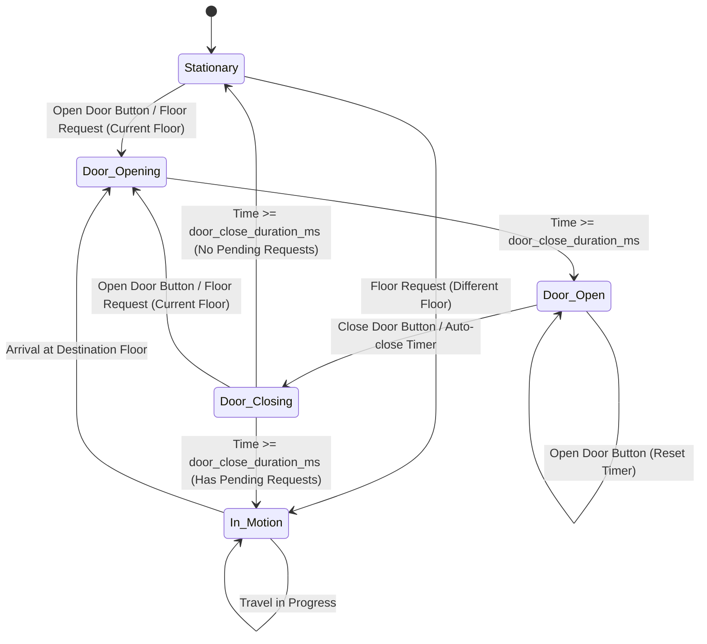

# Real-Time Elevator System Using Finite State Machine

A complete implementation of a real-time elevator control system using Finite State Machine (FSM) design pattern, with a Flask web interface for visualization and control.

## Overview

This project demonstrates how Finite State Machines can effectively manage complex embedded systems with multiple edge cases and environment-dependent behaviors. The elevator cabin operates in real-time, handling door operations, floor requests, and travel between floors through well-defined state transitions.

## System Architecture

### Components

1. **CabinFSM.py** - Core finite state machine implementation
2. **server.py** - Flask backend with real-time event processing
3. **templates/index.html** - Web-based control panel interface

## Finite State Machine Design



## State Descriptions

### 1. Stationary (Door Closed)

**Description:** The elevator is at rest with doors closed, waiting for requests.

**Behaviors:**

- **Open Door Button Pressed:** Transitions to `Door Opening` state
- **Floor Request for Current Floor:** Transitions to `Door Opening` state
- **Floor Request for Different Floor:** Adds request to queue and transitions to `In Motion` state
- **No Requests:** Remains in `Stationary` state

**Exit Conditions:**

- User interaction (door button or floor request)
- Pending floor requests in queue

---

### 2. In Motion

**Description:** The elevator is traveling between floors.

**Behaviors:**

- **Floor Request Received:** Adds floor to request queue (sorted order)
- **Travel Time Elapsed (`current_time - travel_start_time >= travel_duration_ms`):**
  - Updates current floor to destination floor
  - Removes current floor from request queue if present
  - Transitions to `Door Opening` state
- **During Travel:** Continues monitoring time and queuing requests

**Key Features:**

- Uses nearest-floor algorithm to determine next destination
- Removes selected floor from queue when starting motion
- Time-based arrival detection (configurable `travel_duration_ms`)

---

### 3. Door Opening

**Description:** The doors are physically opening (mechanical operation in progress).

**Behaviors:**

- **Floor Request Received:** Adds to queue if not current floor
- **Opening Duration Elapsed (`current_time - door_open_time >= door_close_duration_ms`):** Transitions to `Door Open` state
- **During Opening:** Cannot be interrupted by door buttons

**Duration:** Controlled by `door_close_duration_ms` parameter (default: 1000ms)

---

### 4. Door Open

**Description:** The doors are fully open, allowing passenger entry/exit.

**Behaviors:**

- **Close Door Button Pressed:** Transitions to `Door Closing` state
- **Open Door Button Pressed:** Resets the auto-close timer (`door_open_time = current_time`)
- **Floor Request for Current Floor:** Resets auto-close timer (keeps door open)
- **Floor Request for Different Floor:** Adds to queue
- **Auto-Close Timer Expires (`current_time - door_open_time >= door_open_duration_ms`):** Transitions to `Door Closing` state

**Duration:** Doors stay open for `door_open_duration_ms` (default: 3000ms)

**Key Features:**

- Timer can be reset by Open Door button or current floor request
- Automatically closes after configured duration
- Queues requests for other floors while open

---

### 5. Door Closing

**Description:** The doors are physically closing (mechanical operation in progress).

**Behaviors:**

- **Open Door Button Pressed:** Interrupts closing, transitions to `Door Opening` state
- **Floor Request for Current Floor:** Interrupts closing, transitions to `Door Opening` state (safety feature)
- **Floor Request for Different Floor:** Adds to queue
- **Closing Duration Elapsed (`current_time - door_close_time >= door_close_duration_ms`):**
  - If pending requests exist: Transitions to `In Motion` state
  - If no pending requests: Transitions to `Stationary` state

**Duration:** Controlled by `door_close_duration_ms` parameter (default: 1000ms)

**Safety Features:**

- Can be interrupted by Open Door button
- Can be interrupted by current floor request
- Other floor requests are queued without interruption

---

## Event Types

### 1. Basic Event

- **Type:** `"Basic"`
- **Purpose:** Time progression events sent continuously by the server
- **Frequency:** Every 100ms
- **Attributes:** `time` (milliseconds since server start)

### 2. Floor Press Event

- **Type:** `"Floor Press"`
- **Purpose:** User requests a specific floor
- **Attributes:** `floor` (integer 0 to max_floor), `time`
- **Behavior:** Queued and processed based on current state

### 3. Open Door Press Event

- **Type:** `"Open Door"`
- **Purpose:** User manually requests door opening
- **Attributes:** `time`
- **Behavior:** Opens doors or resets auto-close timer

### 4. Close Door Press Event

- **Type:** `"Close Door"`
- **Purpose:** User manually requests door closing
- **Attributes:** `time`
- **Behavior:** Initiates door closing from Door Open state

---

## Configuration Parameters

### Cabin Initialization

```python
Cabin(
    max_floor=5,                    # Maximum floor number (0-5 = 6 floors)
    travel_duration_ms=2000,        # Time to travel between adjacent floors
    door_open_duration_ms=3000,     # How long doors stay open
    door_close_duration_ms=1000     # Time for doors to physically open/close
)
```

### Timing

- **Update Frequency:** 100ms (background thread sends time events)
- **Default Travel Time:** 2000ms per floor
- **Default Door Open Duration:** 3000ms
- **Default Door Open/Close Animation:** 1000ms

---

## Web Interface Features

### Status Display (Real-Time)

- **Current Time:** Milliseconds since server start
- **State:** Current FSM state name
- **Current Floor:** Elevator's current position
- **Next Floor:** Destination floor (when in motion)
- **Pending Requests:** Queue of floor requests

### Controls

- **Floor Buttons:** Buttons for each floor (0 to max_floor)
- **Open Door Button:** Opens or holds doors open
- **Close Door Button:** Manually closes doors

### Auto-Refresh

- Polls server state every 500ms for real-time updates

---

## Technical Implementation Details

### Thread Safety

- Uses `threading.Lock()` to prevent race conditions
- All FSM state access is protected by locks
- Background thread continuously sends time events

### Time Management

- Server tracks elapsed time since startup
- All events carry timestamps
- FSM uses timestamps for duration-based transitions

### Floor Request Algorithm

Currently implements **Nearest Floor First** algorithm:

```python
next_floor = min(floor_requests, key=lambda f: abs(f - current_floor))
```

Can be extended to implement more sophisticated algorithms like:

- SCAN (elevator algorithm)
- LOOK
- Shortest Seek Time First (SSTF)

---

## Running the System

### Installation

```bash
pip install -r requirements.txt
```

### Start Server

```bash
python server.py
```

### Access Interface

Open browser to: `http://localhost:3000`

---

## API Endpoints

### GET `/`

Returns the web interface

### GET `/api/state`

Returns current elevator state:

```json
{
  "state": "Stationary",
  "floor": 0,
  "next_floor": null,
  "pending_requests": [],
  "current_time": 12345.67
}
```

### POST `/api/press_floor`

Request a floor:

```json
{ "floor": 3 }
```

### POST `/api/open_door`

Open/hold door open

### POST `/api/close_door`

Close door manually

---

## Edge Cases Handled

1. **Pressing Current Floor While Stationary:** Opens doors
2. **Pressing Current Floor While Door Open:** Resets auto-close timer
3. **Pressing Current Floor While Door Closing:** Reopens doors (safety)
4. **Multiple Floor Requests:** Queued and sorted
5. **Door Button During Motion:** Queued for processing at destination
6. **Open Button During Closing:** Interrupts and reopens
7. **Duplicate Floor Requests:** Ignored (not added to queue)
8. **Auto-Close Override:** Open button resets timer indefinitely

---

## State Transition Examples

### Example 1: Simple Floor Request

```
Initial State: Stationary (Floor 0)
Action: Press Floor 3
Result:
  1. Stationary → In Motion (traveling to floor 3)
  2. After 2000ms: In Motion → Door Opening
  3. After 1000ms: Door Opening → Door Open
  4. After 3000ms: Door Open → Door Closing
  5. After 1000ms: Door Closing → Stationary
```

### Example 2: Door Hold Open

```
Initial State: Door Open (Floor 2)
Action: Press Open Door Button
Result: Auto-close timer resets, door remains open for another 3000ms
```

### Example 3: Emergency Door Reopen

```
Initial State: Door Closing (Floor 1)
Action: Press Open Door Button
Result: Door Closing → Door Opening (safety override)
```

### Example 4: Multiple Floor Requests

```
Initial State: Stationary (Floor 0)
Actions:
  1. Press Floor 5
  2. Press Floor 2 (while in motion)
  3. Press Floor 4 (while in motion)
Result:
  1. Goes to Floor 2 (nearest)
  2. Then Floor 4 (next nearest)
  3. Then Floor 5 (furthest)
```

---

## Future Enhancements

- Multiple cabin support
- Advanced scheduling algorithms (SCAN, LOOK)
- Floor call buttons (up/down direction)
- Load balancing between multiple elevators
- Emergency stop functionality
- Door obstruction detection
- Floor approach announcements
- Energy optimization modes

---

## License

MIT License
