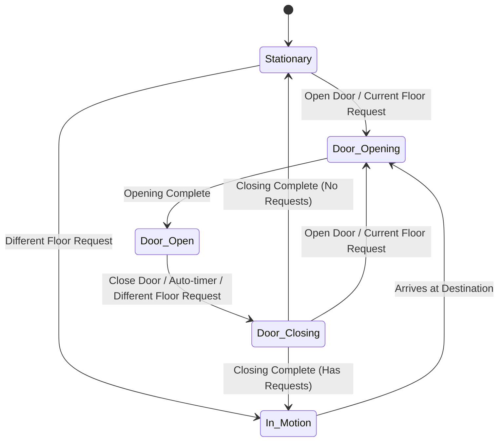

# Technical Challenge: Real-Time Elevator Finite State Machine

## Overview

Your task is to implement a real-time elevator control system using a Finite State Machine (FSM) design pattern. This challenge tests your ability to design state-driven systems that handle complex real-world behaviors and edge cases.

## What is a Finite State Machine?

A Finite State Machine is a computational model used to design systems that can be in exactly one state at any given time. It's particularly useful for:

- Embedded systems with complex behaviors
- Systems with many edge cases
- Real-time control systems
- Event-driven applications

The FSM is modeled as a directed graph where:

- **Nodes** represent possible states
- **Edges** represent events that trigger state transitions

## Your Task

Implement the `update()` method in `CabinFSM.py` to create a fully functional elevator cabin control system.

## Finite State Machine Specification

### States

Your elevator cabin must support 5 distinct states:

1. **Stationary** - Elevator is at rest with doors closed
2. **In Motion** - Elevator is traveling between floors
3. **Door Opening** - Doors are physically opening (takes time)
4. **Door Open** - Doors are fully open
5. **Door Closing** - Doors are physically closing (takes time)

### State Diagram



## Functional Requirements

### State: Stationary

**Expected Behaviors:**

1. When **Open Door button** is pressed:

   - Doors should open

2. When a **Floor button** is pressed for the **current floor**:

   - Doors should open (someone wants to get in)

3. When a **Floor button** is pressed for a **different floor**:

   - Add the floor to the request queue
   - Start moving toward that floor

4. When there are **pending floor requests** in the queue:
   - Start moving toward the next floor

---

### State: In Motion

**Expected Behaviors:**

1. When a **Floor button** is pressed:

   - Add the floor to the request queue (if not already queued)

2. When the elevator **arrives at the destination floor** (enough time has passed):

   - Update current floor to the destination
   - Remove the floor from the request queue if it was in there
   - Start opening the doors

3. While traveling:
   - Continue toward destination floor
   - Queue any new floor requests

---

### State: Door Opening

**Expected Behaviors:**

1. When a **Floor button** is pressed for a **different floor**:

   - Add the floor to the request queue

2. When **opening time has elapsed**:

   - Transition to fully open state

3. During opening:
   - Cannot be interrupted (doors must finish opening)

**Timing:** Takes `door_close_duration_ms` to fully open

---

### State: Door Open

**Expected Behaviors:**

1. When **Close Door button** is pressed:

   - Start closing the doors

2. When **Open Door button** is pressed:

   - Reset the auto-close timer (keep doors open longer)

3. When a **Floor button** is pressed for the **current floor**:

   - Reset the auto-close timer (someone else wants to get in)

4. When a **Floor button** is pressed for a **different floor**:

   - Add the floor to the request queue

5. When **auto-close timer expires** (doors have been open long enough):
   - Automatically start closing the doors

**Timing:** Doors stay open for `door_open_duration_ms` before auto-closing

---

### State: Door Closing

**Expected Behaviors:**

1. When **Open Door button** is pressed:

   - **SAFETY FEATURE:** Stop closing and reopen the doors

2. When a **Floor button** is pressed for the **current floor**:

   - **SAFETY FEATURE:** Stop closing and reopen the doors (someone trying to get in)

3. When a **Floor button** is pressed for a **different floor**:

   - Add the floor to the request queue

4. When **closing time has elapsed**:
   - If there are **pending floor requests**: Start moving to the next floor
   - If there are **no pending requests**: Return to stationary state

**Timing:** Takes `door_close_duration_ms` to fully close

---

## Event Types

Your `update()` method receives events of the following types:

### 1. Basic Event

```python
event.type = "Basic"
event.time = <milliseconds>
```

- Sent continuously (every 100ms) to update time-based transitions
- Use this to check if durations have elapsed

### 2. Floor Press Event

```python
event.type = "Floor Press"
event.floor = <0 to max_floor>
event.time = <milliseconds>
```

- User pressed a floor button

### 3. Open Door Press Event

```python
event.type = "Open Door"
event.time = <milliseconds>
```

- User pressed the open door button

### 4. Close Door Press Event

```python
event.type = "Close Door"
event.time = <milliseconds>
```

- User pressed the close door button

---

## Available Cabin Attributes

```python
self.FSM                      # Current state (string)
self.floor                    # Current floor (integer)
self.next_floor              # Destination floor when in motion
self.floor_requests          # List of requested floors (queue)
self.current_time            # Current time in milliseconds
self.travel_start_time       # When travel started
self.door_open_time          # When doors started opening
self.door_close_time         # When doors started closing

# Configuration (provided)
self.max_floor               # Highest floor number
self.travel_duration_ms      # Time to travel between floors
self.door_open_duration_ms   # How long doors stay open
self.door_close_duration_ms  # How long it takes doors to open/close
```

---

## Helper Methods Available

```python
self._open_door()           # Sets state to "Door Opening" and records time
self._close_door()          # Sets state to "Door Closing" and records time
self._start_moving()        # Picks next floor and starts motion
```

---

## Edge Cases to Handle

Your implementation must correctly handle these scenarios:

1. **Duplicate floor requests** - Don't add the same floor twice to the queue
2. **Current floor request while stationary** - Should open doors, not start moving
3. **Current floor request while door open** - Should reset auto-close timer
4. **Current floor request while door closing** - Should reopen (safety)
5. **Open button while door closing** - Should reopen (safety)
6. **Multiple floor requests** - Should queue all requests
7. **Floor requests while in motion** - Should queue for later
8. **Auto-close timer** - Doors should close automatically after being open

---

## Testing Your Implementation

### Test the Web Interface

1. Install dependencies:

```bash
pip install -r requirements.txt
```

2. Run the server:

```bash
python server.py
```

3. Open browser to `http://localhost:3000`

### Expected Behavior Examples

**Scenario 1: Simple floor request**

- Press Floor 3 from Floor 0
- Should transition: Stationary → In Motion → Door Opening → Door Open → Door Closing → Stationary

**Scenario 2: Emergency reopen**

- While doors are closing, press Open Door
- Should transition: Door Closing → Door Opening

**Scenario 3: Hold doors open**

- While doors are open, press Open Door
- Timer should reset, doors stay open for another 3 seconds

**Scenario 4: Multiple requests**

- Press Floor 5, then Floor 2, then Floor 4
- Should visit floors in nearest-first order: 2, 4, 5
